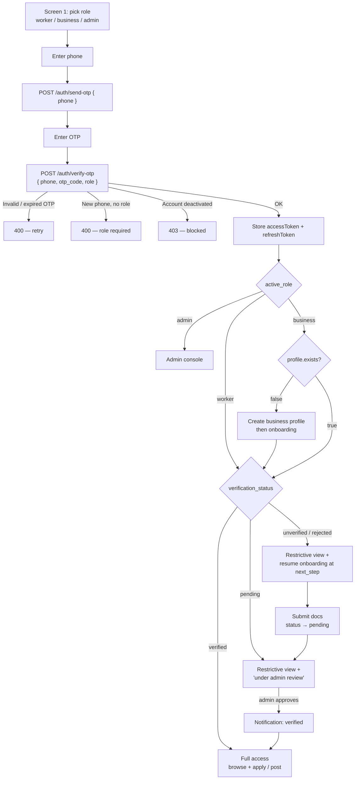

# WorkforceBD API Guidelines

Local Base URL: `http://localhost:3000/api/v1`
Cloud Base URL: `https://workforcebd.onrender.com/api/v1`
---

## General

### Request Headers

| Header | Value | Required |
|---|---|---|
| `Content-Type` | `application/json` | All POST/PUT/PATCH |
| `Authorization` | `Bearer <access_token>` | Protected routes |

### Response Format

All responses follow this structure:

**Success**
```json
{
  "success": true,
  "message": "Human readable message",
  "data": { }
}
```

**Error**
```json
{
  "success": false,
  "message": "Human readable error message",
  "errors": [ ]
}
```

### HTTP Status Codes

| Code | Meaning |
|---|---|
| `200` | OK |
| `201` | Created |
| `400` | Bad request / business logic error |
| `401` | Unauthenticated |
| `403` | Forbidden / insufficient role |
| `404` | Not found |
| `422` | Validation failed |
| `500` | Server error |

---

## Roles & Access

Every user has a `roles` array. Possible values: `worker`, `business`, `admin`.

- One account can hold multiple roles (e.g. a user can be both `worker` and `business`)
- Most features require admin verification of the profile before access is granted
- `admin` role is assigned manually — not available via registration

| Role | Can do |
|---|---|
| `worker` | Browse shifts, apply, track earnings |
| `business` | Post shifts, manage applications, hire workers |
| `admin` | Verify profiles, moderate content, manage platform |

---

## Auth

## Authentication Flow

A single passwordless, role-first flow handles both first-time signup and returning login. The user picks a role on the first screen, enters their phone, and verifies an OTP. The server creates the account on first use or logs the user in. Account access stays restrictive (look-only) until an admin verifies the profile.

### Visual Diagram




### GET `/auth/me`

Returns the authenticated user's data plus a per-role profile summary. Call this on app open to validate the session, decide between full and restrictive (look-only) access, and resume onboarding.

**Headers**
```
Authorization: Bearer <access_token>
```

**Response `200`**
```json
{
  "success": true,
  "message": "Authenticated",
  "data": {
    "id": "uuid",
    "phone": "+8801712345678",
    "email": null,
    "full_name": null,
    "roles": ["worker"],
    "is_phone_verified": true,
    "profiles": {
      "worker": {
        "exists": true,
        "verification_status": "unverified",
        "profile_completion": 25,
        "next_step": "skills"
      },
      "business": null
    }
  }
}
```

When `roles` holds **both** `worker` and `business`, show the "Switch account" button (both `profiles.*` are non-null) and call [`/auth/switch-role`](#post-authswitch-role) to flip context.

A role's `profiles.<role>` is `null` when the user does not hold that role. For roles the user holds:

| Field | Meaning |
|---|---|
| `exists` | Whether a profile row exists (worker stub is auto-created at auth; business is not) |
| `verification_status` | `unverified` · `pending` · `verified` · `rejected` — drives full vs restrictive access |
| `profile_completion` | Worker only. Percent of onboarding steps done (0–100) |
| `next_step` | Next onboarding step to route to: `basic` · `skills` · `availability` · `documents` · `create_business` · `null` (done/verified) |

**Error `401`** — token missing, invalid, or expired → call `/auth/refresh` then retry.

---

### POST `/auth/send-otp`

Request an OTP to the given phone number. There is no login/register split — the same call serves both. Role is not needed here; it is chosen on the first screen and sent at verify time.

**Request Body**
```json
{
  "phone": "+8801712345678"
}
```

| Field | Type | Required | Values |
|---|---|---|---|
| `phone` | string | always | BD mobile, format `+8801XXXXXXXXX` |

**Response `200`**
```json
{
  "success": true,
  "message": "OTP sent successfully"
}
```

**Error `422`** — validation failed
```json
{
  "success": false,
  "message": "Validation failed",
  "errors": [
    { "msg": "Invalid phone number", "path": "phone" }
  ]
}
```

> **Rate limit:** 3 requests per phone per 10 minutes.
> **Note (dev only):** OTP is printed to the server console. SMS gateway not integrated yet. OTPs are stored hashed (SHA-256) at rest.

---

### POST `/auth/verify-otp`

Verify OTP. One unified path — the server creates the account on first use or logs the user in if the phone is already known. Returns tokens, user, and the active role's profile summary.

**Request Body**
```json
{
  "phone": "+8801712345678",
  "otp_code": "482910",
  "role": "worker"
}
```

| Field | Type | Required | Values |
|---|---|---|---|
| `phone` | string | always | Same phone used in send-otp |
| `otp_code` | string | always | 6-digit numeric |
| `role` | string | conditional | `worker` · `business`. **Required when the phone has no account yet** (account creation). Omit for admin login. |

**Behaviour by case**

| Case | Result |
|---|---|
| New phone + `role` | Account created with `[role]`. Worker gets a profile stub. |
| Known phone + new `role` | `role` appended to existing `roles`. Worker gets a profile stub. No duplicate account. |
| Known phone + held `role` (or no `role`) | Plain login. |
| New phone, no `role` | `400` — role required. |

**Response `200`**
```json
{
  "success": true,
  "message": "Authentication successful",
  "data": {
    "accessToken": "<jwt>",
    "refreshToken": "<token>",
    "user": {
      "id": "uuid",
      "phone": "+8801712345678",
      "email": null,
      "full_name": null,
      "roles": ["worker"],
      "is_phone_verified": true
    },
    "active_role": "worker",
    "profile": {
      "exists": true,
      "verification_status": "unverified",
      "profile_completion": 0,
      "next_step": "basic"
    }
  }
}
```

`active_role` is the account context the new token carries: the role passed in, or — for a returning user who omitted it — their first role (`null` only if the user somehow holds no worker/business role). It's enforced on role-specific endpoints (see [Account context](#account-context-active-role)). `profile` is that role's summary (same shape as in `/auth/me`) — use `verification_status` to decide full vs restrictive access and `next_step` to route into onboarding. For business, `profile.exists` is `false` until the business profile is created.

**Error `400`** — OTP invalid or expired
```json
{
  "success": false,
  "message": "Invalid or expired OTP"
}
```

**Error `400`** — new phone without a role
```json
{
  "success": false,
  "message": "Role is required to create an account"
}
```

**Error `403`** — account deactivated
```json
{
  "success": false,
  "message": "Account is deactivated"
}
```

> **Rate limit:** 5 verify attempts per IP per 15 minutes.
> Store `accessToken` and `refreshToken` securely. Access token expires in **15 minutes**. Refresh token expires in **30 days**.

---

### POST `/auth/switch-role`

Switches the active account context for a user who holds **both** roles (worker ⇄ business) — backs the "Switch account" button on the profile screen. Requires `Authorization: Bearer <access_token>`.

A user gains the second role through the normal login flow: sign in with the same number via [`/auth/verify-otp`](#post-authverify-otp) and pass the other `role` — it's added to the account. Once `roles` holds both, the app shows the switch button (derive from `/auth/me` → `roles`).

Returns a **new access token** carrying the new context (`active_role`). The app must replace its stored access token with this one — the old token keeps its old context until it expires, and role-specific endpoints are now **enforced by active context** (see [Account context](#account-context-active-role)). The refresh token is unchanged. The response also carries the target role's profile summary so the app can route to the full or onboarding view.

**Body**

| Field | Type | Required | Notes |
|---|---|---|---|
| `role` | enum | ✅ | `worker` \| `business` — must be a role the user already holds |

**Response `200`** — `"Switched to <role> account"`
```json
{
  "success": true,
  "message": "Switched to business account",
  "data": {
    "accessToken": "<new JWT — replace your stored token>",
    "active_role": "business",
    "user": { "id": "uuid", "phone": "+8801…", "email": null, "full_name": "…", "roles": ["worker", "business"], "is_phone_verified": true },
    "profile": { "exists": true, "verification_status": "verified", "next_step": null }
  }
}
```
`profile` is the target role's summary (same shape as `/auth/me` → `profiles.<role>`). For `business` with the role but no profile yet, `exists` is `false` and `next_step` is `create_business` — route to onboarding.

**Errors**

| Code | Message | Cause |
|---|---|---|
| `403` | `You don't have a <role> account. …` | `role` not in the user's `roles` |
| `401` | `Authorization token required` | Missing/invalid token |
| `422` | `Validation failed` | `role` missing or not `worker`/`business` |

---

### POST `/auth/refresh`

Get a new access token using a valid refresh token.

**Request Body**
```json
{
  "refresh_token": "<refresh_token>"
}
```

**Response `200`**
```json
{
  "success": true,
  "message": "Token refreshed",
  "data": {
    "accessToken": "<new_jwt>",
    "refreshToken": "<new_refresh_token>"
  }
}
```

**Error `401`** — token unknown, expired, or session inactive
```json
{
  "success": false,
  "message": "Invalid or expired refresh token"
}
```

**Error `401`** — revoked token replayed (theft detection)
```json
{
  "success": false,
  "message": "Session has been terminated for security reasons"
}
```

> Call this when any protected request returns `401`. **Replace both** stored `accessToken` and `refreshToken` — the old refresh token is invalidated on use (token rotation).
>
> **Reuse detection:** refresh tokens are single-use. Replaying a token that was already rotated revokes the **entire session** (treated as theft). Never reuse or share a refresh token across requests. Tokens are stored hashed at rest, so a token value cannot be recovered from the database.

---

### POST `/auth/logout`

Revokes the session tied to the refresh token.

**Request Body**
```json
{
  "refresh_token": "<refresh_token>"
}
```

**Response `200`**
```json
{
  "success": true,
  "message": "Logged out successfully"
}
```

> Delete both tokens from client storage after this call.

---


### Sign Up / Log In (unified)

```
1. User picks role (worker / business) on the first screen, then enters phone
        │
        ▼
   POST /auth/send-otp  { phone }
        │
        ▼
2. User enters OTP
        │
        ▼
   POST /auth/verify-otp  { phone, otp_code, role }
        │            (role required only when the phone has no account yet)
        │
        ├── success → store accessToken + refreshToken
        │            read data.active_role + data.profile.verification_status
        │              · verified            → full access
        │              · unverified/pending  → restrictive view, route to data.profile.next_step
        │            worker: profile stub auto-created on first use
        │            business: create business profile after auth (profile.exists = false)
        │
        ├── 400     → invalid OTP, or role missing for a new phone → show message / retry
        └── 403     → account deactivated
```

### Returning User (App Open)

```
App opens → read stored accessToken + refreshToken
        │
        ▼
GET /auth/me  (Authorization: Bearer <accessToken>)
        │
        ├── 200 → session valid, render app with returned user data
        │
        └── 401 → POST /auth/refresh { refresh_token }
                        │
                        ├── 200 → store new accessToken, retry GET /auth/me
                        └── 401 → tokens dead, clear storage, go to login
```

### Token Refresh

```
Protected request returns 401
        │
        ▼
POST /auth/refresh  { refresh_token: "..." }
        │
        ├── 200 → update stored accessToken + refreshToken, retry original request
        └── 401 → both tokens expired, redirect to login
```

---

## Verification Gate

After sign up, workers and businesses must be verified by an admin before using gated features. Until then the account has restrictive (look-only) access: it can authenticate, browse, and complete onboarding, but gated actions are blocked server-side.

| `verification_status` | Meaning |
|---|---|
| `unverified` | Signed up, no docs submitted |
| `pending` | Docs submitted, awaiting admin review |
| `verified` | Approved — full platform access |
| `rejected` | Rejected — user must re-submit docs |

**Server-side gate.** Gated endpoints are protected by a `requireVerifiedProfile(role)` guard, not just client checks. A non-verified user hitting one gets a `403`:

| Condition | `403` message |
|---|---|
| No profile for that role yet | `Complete your <role> profile to continue` |
| Profile exists but not `verified` | `Your <role> profile must be verified by an admin first` |

Currently gated:

| Endpoint | Required role + verified |
|---|---|
| `POST /applications` (apply to shift) | `worker`, verified |
| `POST /applications/:id/check-in` (shift check-in) | `worker`, verified |
| `POST /applications/:id/check-out` (shift check-out) | `worker`, verified |
| `POST /payments/payouts` (request withdrawal) | `worker`, verified |
| `POST /payments/shifts/:shiftId/settle` (pay workers) | `business`, verified |

> Read `verification_status` from `/auth/verify-otp` or `/auth/me`, and route unverified users to onboarding (`profile.next_step`). Treat the client gate as UX only — the server is the source of truth.

---

## Account context (active role)

A user may hold both `worker` and `business` roles. The access token carries an **`active_role`** claim — the account context it's currently acting as — set at login (the role signed in with, else the user's first role) and changed via [`/auth/switch-role`](#post-authswitch-role). It's persisted on the session, so it survives `/auth/refresh`.

Role-specific endpoint groups are **enforced by active context**, not just membership:

| Context (`active_role`) | Allowed endpoint groups |
|---|---|
| `worker` | `/worker/*`, `/shifts/*`, `/applications/*`, worker `/payments/*` (wallet, payouts) |
| `business` | `/business/*`, business `/payments/*` (complete, settle) |

A dual-role user in the **wrong context** gets `403 Switch to your <role> account to use this feature` — call `/auth/switch-role` (which returns a fresh token), then retry. Admin endpoints (`/admin/*`) are membership-based and unaffected. Context-neutral endpoints (notifications, chat, realtime, upload) are not gated by context.

> Tokens minted before this rollout have no `active_role` claim; they fall back to membership checks until refreshed (≤15 min). No re-login required.

---

## Categories

Shared reference data — used by businesses when creating shifts (`category_id` is required) and by workers as a discovery filter.

### GET `/categories`

Returns all active categories for selection dropdowns. Requires auth; readable by any active role (worker, business, admin).

**Response `200`**
```json
{
  "success": true,
  "message": "Categories fetched",
  "data": [
    { "id": "uuid", "name": "Event Staff", "icon_url": null },
    { "id": "uuid", "name": "Restaurant Staff", "icon_url": null }
  ]
}
```

---

## Worker Profile

All endpoints require:
- `Authorization: Bearer <access_token>`
- Active context must be `worker` (see [Account context](#account-context-active-role))

---

### GET `/worker/profile`

Returns full worker profile including skills and preferred zones.

**Response `200`**
```json
{
  "success": true,
  "message": "Profile fetched",
  "data": {
    "id": "uuid",
    "user_id": "uuid",
    "full_name": null,
    "gender": null,
    "date_of_birth": null,
    "profile_picture": null,
    "availability_days": [],
    "availability_slots": [],
    "verification_status": "unverified",
    "reliability_score": 0,
    "worker_skills": [
      { "skill_id": "uuid", "skills": { "id": "uuid", "name": "Bartender" } }
    ],
    "worker_preferred_zones": [
      { "zone_id": "uuid", "zones": { "id": "uuid", "name": "Gulshan" } }
    ]
  }
}
```

---

### GET `/worker/skills`

Returns all active skills for onboarding selection dropdowns. Requires auth + `worker` role.

**Response `200`**
```json
{
  "success": true,
  "message": "Skills fetched",
  "data": [
    { "id": "uuid", "name": "Bartender", "category_id": "uuid" },
    { "id": "uuid", "name": "Waiter / Food Runner", "category_id": "uuid" }
  ]
}
```

---

### GET `/worker/zones`

Returns all active zones (with their city) for onboarding selection dropdowns. Requires auth + `worker` role.

**Query Params**

| Param | Type | Required | Notes |
|---|---|---|---|
| `city_id` | UUID | no | Scopes results to a single city |

**Response `200`**
```json
{
  "success": true,
  "message": "Zones fetched",
  "data": [
    { "id": "uuid", "name": "Gulshan", "city_id": "uuid", "cities": { "id": "uuid", "name": "Dhaka" } }
  ]
}
```

---

### PATCH `/worker/profile/basic` — Step 1 of 5 (20%)

Saves personal info and preferred work zones.

**Request Body**
```json
{
  "full_name": "Rahim Hossain",
  "gender": "male",
  "date_of_birth": "2000-05-15",
  "profile_picture": "https://cdn.example.com/avatars/rahim.jpg",
  "zone_ids": ["uuid-gulshan", "uuid-banani"]
}
```

| Field | Type | Required | Notes |
|---|---|---|---|
| `full_name` | string | yes | max 100 chars |
| `gender` | string | no | `male` · `female` · `other` · `prefer_not_to_say` |
| `date_of_birth` | string | no | `YYYY-MM-DD` format |
| `profile_picture` | string | no | URL — upload to cloud first, send URL here |
| `zone_ids` | UUID[] | no | IDs from zones table (Banani, Gulshan, Dhanmondi, Baridhara, Bashundhara, DOHS, Uttara, Mohakhali) |

**Response `200`**
```json
{
  "success": true,
  "message": "Basic info saved",
  "data": { "...updated worker_profile fields" }
}
```

**Error `400`** — invalid zone IDs
```json
{
  "success": false,
  "message": "One or more zone IDs are invalid"
}
```

---

### PATCH `/worker/profile/skills` — Step 2 of 5 (40%)

Replaces all worker skills. Send the full desired set each time.

**Request Body**
```json
{
  "skill_ids": ["uuid-waiter-food-runner", "uuid-cleaning-support"]
}
```

| Field | Type | Required | Notes |
|---|---|---|---|
| `skill_ids` | UUID[] | yes | Min 1. Replaces all previous skills. |

Available skills (fetch IDs from `GET /worker/skills`):

| Skill name |
|---|
| Waiter / Food Runner |
| Bartender |
| Promoter / Activation Crew |
| Event Support Staff |
| Production Assistant |
| Cleaning & Support Helper |
| Security Staff |
| Receptionist / Host |

**Response `200`**
```json
{
  "success": true,
  "message": "Skills saved",
  "data": { "...worker_profile with updated skills" }
}
```

**Error `400`** — invalid skill IDs
```json
{
  "success": false,
  "message": "One or more skill IDs are invalid"
}
```

---

### PATCH `/worker/profile/availability` — Step 3 of 5 (60%)

Saves availability schedule and refines preferred zones.

**Request Body**
```json
{
  "availability_days": ["weekdays"],
  "availability_slots": ["morning", "evening"],
  "zone_ids": ["uuid-gulshan", "uuid-bashundhara"]
}
```

| Field | Type | Required | Values |
|---|---|---|---|
| `availability_days` | string[] | yes | `weekdays` (Mon–Fri) · `weekends` (Sat–Sun) |
| `availability_slots` | string[] | yes | `morning` (6am–12pm) · `evening` (12pm–8pm) · `night` (8pm–2am) |
| `zone_ids` | UUID[] | no | Replaces preferred zones if provided |

**Response `200`**
```json
{
  "success": true,
  "message": "Availability saved",
  "data": { "...updated worker_profile fields" }
}
```

---

### PATCH `/worker/profile/documents` — Step 4 of 5 (80%)

Submits document URLs for admin KYC review. Sets `verification_status` to `pending`.

> **Upload flow:** Upload images directly to cloud storage from the frontend. Send the resulting URLs to this endpoint. Server stores URLs only.

**Request Body**
```json
{
  "nid_front_url": "https://cdn.example.com/docs/nid-front.jpg",
  "nid_back_url": "https://cdn.example.com/docs/nid-back.jpg",
  "selfie_url": "https://cdn.example.com/docs/selfie.jpg",
  "student_id_url": "https://cdn.example.com/docs/student-id.jpg"
}
```

| Field | Type | Required | Notes |
|---|---|---|---|
| `nid_front_url` | string | yes | URL to NID front photo |
| `nid_back_url` | string | yes | URL to NID back photo |
| `selfie_url` | string | yes | URL to live selfie photo |
| `student_id_url` | string | no | Optional — boosts credibility score |

**Response `200`**
```json
{
  "success": true,
  "message": "Documents submitted. Pending admin verification.",
  "data": { "...worker_profile with verification_status: 'pending'" }
}
```

**Error `400`** — already verified
```json
{
  "success": false,
  "message": "Profile already verified"
}
```

---

### Worker Onboarding Flow

```
Sign up (auth) → worker_profile stub auto-created
        │
        ▼
PATCH /worker/profile/basic        (Step 1 — name, gender, DOB, zones)
        │
        ▼
PATCH /worker/profile/skills       (Step 2 — select skills)
        │
        ▼
PATCH /worker/profile/availability (Step 3 — days, time slots, zones)
        │
        ▼
PATCH /worker/profile/documents    (Step 4 — NID + selfie URLs)
        │
        ▼
verification_status → "pending"
        │
        ▼ (admin approves)
verification_status → "verified"
reliability_score   → 5.0 (Beginner)
XP Earned          → 250 (Level 1)
        │
        ▼
Worker can now browse and apply for shifts
```

---

## Shifts (Discovery)

Worker-facing shift discovery feed and detail. All endpoints require:
- `Authorization: Bearer <access_token>`
- Active context must be `worker` (see [Account context](#account-context-active-role))

Only shifts with status `published` or `applications_open` (and `shift_date` today or later) appear in discovery. Each shift carries computed slot counters:

| Field | Meaning |
|---|---|
| `filled` | Count of `accepted` applications |
| `capacity` | `workers_needed` |
| `is_full` | `filled >= capacity` |

---

### GET `/shifts/dashboard`

Personalized counters for the home screen.

**Response `200`**
```json
{
  "success": true,
  "message": "Dashboard fetched",
  "data": {
    "shifts_today": 4,
    "nearby": 7,
    "urgent": 2
  }
}
```

| Counter | Definition |
|---|---|
| `shifts_today` | Open shifts dated today |
| `nearby` | Open shifts in the worker's preferred zones (0 if none set) |
| `urgent` | Open shifts that are `instant` type or start within the next 2 days |

---

### GET `/shifts`

Paginated, filtered discovery feed.

**Query Parameters**

| Param | Type | Default | Values / Notes |
|---|---|---|---|
| `filter` | string | `all` | `all` · `nearby` · `urgent` · `high_pay` |
| `zone_id` | UUID | — | Restrict to a single zone |
| `category_id` | UUID | — | Restrict to a single category |
| `page` | int | `1` | ≥ 1 |
| `limit` | int | `10` | 1–50 |

Filter semantics:

| `filter` | Returns |
|---|---|
| `all` | All open shifts, soonest first |
| `nearby` | Shifts in the worker's preferred zones (empty result if the worker has none) |
| `urgent` | `instant` shifts or those starting within 2 days |
| `high_pay` | `pay_amount` ≥ ৳1000, highest pay first |

**Example**
```
GET /api/v1/shifts?filter=high_pay&page=1&limit=10
```

**Response `200`**
```json
{
  "success": true,
  "message": "Shifts fetched",
  "data": {
    "items": [
      {
        "id": "uuid",
        "title": "Waiter for Corporate Event",
        "description": "Evening banquet service",
        "role_type": "Waiter",
        "shift_type": "scheduled",
        "shift_date": "2026-06-20",
        "start_time": "1970-01-01T12:00:00.000Z",
        "end_time": "1970-01-01T20:00:00.000Z",
        "pay_amount": "1500",
        "currency": "BDT",
        "workers_needed": 8,
        "meal_included": true,
        "transport_support": false,
        "address": "Banani, Road 11",
        "landmark": "Next to the bank",
        "coordinates": { "latitude": 23.7937, "longitude": 90.4066 },
        "zone_id": "uuid",
        "status": "published",
        "business_profiles": { "id": "uuid", "business_name": "Sky Lounge", "logo_url": null },
        "categories": { "id": "uuid", "name": "Waiter" },
        "zones": { "id": "uuid", "name": "Banani" },
        "filled": 3,
        "capacity": 8,
        "is_full": false,
        "has_applied": false,
        "my_application": null
      }
    ],
    "pagination": { "page": 1, "limit": 10, "total": 23, "total_pages": 3 }
  }
}
```

> `start_time` / `end_time` are time-only values returned as ISO timestamps on the `1970-01-01` epoch date — read the time portion only.
>
> `coordinates` is `{ latitude, longitude }` (WGS84) decoded from the PostGIS point, or `null` when the shift has no location set. Present on both the list and detail responses. On detail, the nested `business_profiles` carries its own `coordinates` in the same shape.
>
> `has_applied` / `my_application` reflect the **requesting worker's** own application on the shift. `my_application` is `{ id, status }` (status is any of the [application lifecycle](#applications) values, e.g. `pending`, `accepted`, `withdrawn`) or `null` if the worker never applied. When `has_applied` is `true` the apply button should be disabled — re-apply is rejected server-side (`409`), including after a withdrawal. Present on both list and detail.

**Error `422`** — invalid query param
```json
{
  "success": false,
  "message": "Validation failed",
  "errors": [{ "msg": "Invalid filter", "path": "filter" }]
}
```

---

### GET `/shifts/:id`

Single shift detail. Includes richer business info (reliability + verification).

| Path param | Type | Notes |
|---|---|---|
| `id` | UUID | Shift ID |

**Response `200`**
```json
{
  "success": true,
  "message": "Shift fetched",
  "data": {
    "id": "uuid",
    "title": "Waiter for Corporate Event",
    "description": "Evening banquet service",
    "shift_date": "2026-06-20",
    "start_time": "1970-01-01T12:00:00.000Z",
    "end_time": "1970-01-01T20:00:00.000Z",
    "pay_amount": "1500",
    "currency": "BDT",
    "workers_needed": 8,
    "meal_included": true,
    "transport_support": false,
    "coordinates": { "latitude": 23.7937, "longitude": 90.4066 },
    "status": "published",
    "business_profiles": {
      "id": "uuid",
      "business_name": "Sky Lounge",
      "logo_url": null,
      "reliability_score": "0",
      "verification_status": "verified",
      "coordinates": { "latitude": 23.7925, "longitude": 90.4078 }
    },
    "categories": { "id": "uuid", "name": "Waiter" },
    "zones": { "id": "uuid", "name": "Banani" },
    "filled": 3,
    "capacity": 8,
    "is_full": false,
    "has_applied": true,
    "my_application": { "id": "uuid", "status": "pending" }
  }
}
```

**Error `404`** — not found
```json
{
  "success": false,
  "message": "Shift not found"
}
```

---

## Applications

Worker applies to shifts and tracks application state. All endpoints require:
- `Authorization: Bearer <access_token>`
- Active context must be `worker` (see [Account context](#account-context-active-role))

`POST /applications` additionally requires an **admin-verified** worker profile (see [Verification Gate](#verification-gate)). Listing and withdrawing do not.

**Application status lifecycle**

| Status | Meaning |
|---|---|
| `pending` | Applied; awaiting business decision |
| `shortlisted` | Business is considering the worker |
| `accepted` | Selected — occupies a slot |
| `rejected` | Not selected |
| `withdrawn` | Worker pulled out — terminal, cannot re-apply to this shift |
| `no_show` | Accepted but did not attend |

---

### POST `/applications`

Apply to a shift. Requires a verified worker profile. On success the owning business is notified instantly (`notification:new`, `data.kind = "new_applicant"` with `shift_id` + `application_id`).

**Request Body**
```json
{
  "shift_id": "uuid",
  "note": "Available from 4pm, have my own black formal."
}
```

| Field | Type | Required | Notes |
|---|---|---|---|
| `shift_id` | UUID | yes | Target shift |
| `note` | string | no | Optional message, ≤ 500 chars |

**Response `201`**
```json
{
  "success": true,
  "message": "Applied successfully",
  "data": {
    "id": "uuid",
    "shift_id": "uuid",
    "worker_profile_id": "uuid",
    "status": "pending",
    "note": "Available from 4pm, have my own black formal.",
    "applied_at": "2026-06-16T10:00:00.000Z"
  }
}
```

> Withdrawal is **terminal** — once a worker withdraws from a shift they cannot apply to it again.

**Errors**

| Code | Message | Cause |
|---|---|---|
| `403` | `Your worker profile must be verified by an admin first` | Profile not verified |
| `403` | `Complete your worker profile to continue` | No worker profile yet |
| `404` | `Shift not found` | Unknown/deleted shift |
| `409` | `This shift is not accepting applications` | Shift not in an applyable state |
| `409` | `This shift has already passed` | `shift_date` in the past |
| `409` | `This shift is already full` | All slots accepted |
| `409` | `You have already applied to this shift` | Active application exists |
| `409` | `You have withdrawn from this shift and cannot apply again` | Prior withdrawal (terminal) |

---

### GET `/applications`

The worker's application tracker, newest first.

**Query Parameters**

| Param | Type | Default | Values |
|---|---|---|---|
| `status` | string | — | `pending` · `shortlisted` · `accepted` · `rejected` · `withdrawn` · `no_show` |
| `page` | int | `1` | ≥ 1 |
| `limit` | int | `10` | 1–50 |

**Response `200`**
```json
{
  "success": true,
  "message": "Applications fetched",
  "data": {
    "items": [
      {
        "id": "uuid",
        "status": "pending",
        "note": null,
        "applied_at": "2026-06-16T10:00:00.000Z",
        "shifts": {
          "id": "uuid",
          "title": "Waiter for Corporate Event",
          "shift_date": "2026-06-20",
          "start_time": "1970-01-01T12:00:00.000Z",
          "end_time": "1970-01-01T20:00:00.000Z",
          "pay_amount": "1500",
          "status": "published",
          "business_profiles": { "business_name": "Sky Lounge", "logo_url": null },
          "zones": { "name": "Banani" }
        }
      }
    ],
    "pagination": { "page": 1, "limit": 10, "total": 5, "total_pages": 1 }
  }
}
```

---

### PATCH `/applications/:id/withdraw`

Withdraw an application. Allowed only while `pending` or `shortlisted`.

| Path param | Type | Notes |
|---|---|---|
| `id` | UUID | Application ID (must belong to the worker) |

**Response `200`**
```json
{
  "success": true,
  "message": "Application withdrawn",
  "data": { "id": "uuid", "status": "withdrawn" }
}
```

**Errors**

| Code | Message | Cause |
|---|---|---|
| `404` | `Application not found` | Not found or not owned by this worker |
| `409` | `Cannot withdraw an application in '<state>' state` | Already accepted/rejected/etc. |

---

### POST `/applications/:id/check-in`

Worker checks in to an **accepted** shift (live attendance). Requires an admin-verified worker profile. A `worker_assignments` row is created when the business accepts the applicant; check-in stamps it.

**Presence is always proven by the GPS geofence** — `coordinates` are required for every method and the worker must be within **200 m** of the shift location (PostGIS geofence). The methods differ only in the extra proof layered on top:
- **GPS** — geofence only.
- **QR** — geofence **plus** a live `qr_token`. The business displays a rotating on-site code (`checkin_code` from the [roster](#get-businessshiftsidroster)) which the worker scans. The code rotates every ~30 s, so a screenshotted/shared code expires almost immediately, and the geofence still blocks any off-site relay.

> `manual` is **not** worker-selectable — it is reserved as a business/admin override and rejected from this endpoint.

Allowed only within the shift window: from **30 min before** `start_time` until `end_time` (overnight shifts roll the end over a day).

| Path param | Type | Notes |
|---|---|---|
| `id` | UUID | Application ID (must belong to the worker) |

**Body**

| Field | Type | Required | Notes |
|---|---|---|---|
| `method` | string | yes | `gps` · `qr` |
| `coordinates` | object | always | `{ "latitude": number, "longitude": number, "accuracy"?: number }` |
| `coordinates.accuracy` | number | no | GPS accuracy in metres; rejected if worse than **100 m** |
| `qr_token` | string | if `qr` | Rotating code scanned from the business's roster screen |

```json
{ "method": "qr", "qr_token": "a1b2c3d4e5", "coordinates": { "latitude": 23.8103, "longitude": 90.4125, "accuracy": 12 } }
```

**Response `200`**
```json
{
  "success": true,
  "message": "Checked in",
  "data": { "id": "uuid", "checked_in_at": "2026-06-22T12:00:00.000Z", "checkin_method": "qr" }
}
```

**Errors**

| Code | Message | Cause |
|---|---|---|
| `404` | `Application not found` | Not found or not owned by this worker |
| `409` | `Only an accepted application can be checked in` | Application not in `accepted` |
| `409` | `No roster assignment found for this application` | Assignment row missing |
| `409` | `Cannot check in to a '<state>' shift` | Shift `cancelled`/`closed` |
| `409` | `You have already checked in` | Already checked in |
| `422` | `Check-in is only allowed within the shift's time window` | Outside [start − 30 min, end] |
| `422` | `You must be within 200m of the shift location` | Outside geofence |
| `422` | `Location accuracy is too low (±<n>m). Move to open sky and retry` | GPS accuracy worse than 100 m |
| `422` | `Invalid or expired check-in QR code` | `qr_token` does not match the current rotating code |
| `422` | `coordinates are required to check in` / `qr_token is required for QR check-in` | Missing method payload |

> On check-in the owning business is notified in real time with a `{ kind: "checkin" }` payload carrying the live `checked_in`/`needed` counts.

---

### POST `/applications/:id/check-out`

Worker checks out of a shift they previously checked into. Requires an admin-verified worker profile.

| Path param | Type | Notes |
|---|---|---|
| `id` | UUID | Application ID (must belong to the worker) |

**Response `200`**
```json
{
  "success": true,
  "message": "Checked out",
  "data": { "id": "uuid", "checked_out_at": "2026-06-22T20:00:00.000Z" }
}
```

**Errors**

| Code | Message | Cause |
|---|---|---|
| `404` | `Application not found` | Not found or not owned by this worker |
| `409` | `You have not checked in yet` | No prior check-in |
| `409` | `You have already checked out` | Already checked out |

---

## Business

Business-side endpoints: profile onboarding, shift management, applicant screening, and the home dashboard. All endpoints require:
- `Authorization: Bearer <access_token>`
- Active context must be `business` (see [Account context](#account-context-active-role)) — the `business` role is chosen on the role-select screen, added on first `business` OTP login

Base path: `/api/v1/business`. Onboarding and read endpoints do **not** require a verified profile — a business builds its profile and browses here. **Impactful actions require an admin-verified profile** (see the verification gate below).

> **Verification gate:** Onboarding (`POST/PATCH /business/profile*`) and all reads (`GET` profile, wallet, dashboard, shifts, applicants, roster) are open to an `unverified` business so it can complete its profile and submit documents. The following **require `verification_status = verified`** and otherwise return `403`:
> - `POST /business/wallet/topup`
> - `POST /business/shifts`, `PATCH /business/shifts/:id`, `PATCH /business/shifts/:id/publish`, `PATCH /business/shifts/:id/cancel`
> - `PATCH /business/applications/:id/{shortlist,accept,reject}`
> - `POST /payments/shifts/:shiftId/settle` (see [Payments](#payments))
>
> `403` body: `{ "success": false, "message": "Your business profile must be verified by an admin first" }` (or `"Complete your business profile to continue"` when no profile exists).

> **Shift moderation:** Submitting a shift does **not** make it instantly visible. It enters `pending_approval` and an admin must approve it (`pending_approval` → `published`) before workers can see/apply. Rejection returns it to `draft` for the business to edit and resubmit (see [Admin](#admin)).

### Shift status lifecycle
`draft` → `pending_approval` (submitted) → `published` (admin-approved, worker-visible) → `applications_open` → … On rejection a shift returns to `draft`.

### Verification states
`unverified` (default) → `pending` (documents submitted) → `verified` / `rejected` (admin decision). Mirrors the [Verification Gate](#verification-gate).

---

### GET `/business/profile`

Returns the full business profile (screen 17).

**Response `200`**
```json
{
  "success": true,
  "message": "Profile fetched",
  "data": {
    "id": "uuid",
    "user_id": "uuid",
    "business_name": "The Wedding Studio",
    "business_type": "Events & Wedding",
    "logo_url": "https://...",
    "manager_name": "Karim Ahmed",
    "manager_phone": "+8801712345678",
    "address": "House 12, Road 45, Gulshan-2",
    "landmark": "Near Gulshan Club",
    "coordinates": { "latitude": 23.7925, "longitude": 90.4078 },
    "zone_id": "uuid",
    "verification_status": "verified",
    "meal_included": true,
    "transport_support": true,
    "female_friendly": true,
    "uniform_required": false,
    "reliability_score": "0",
    "zones": { "id": "uuid", "name": "Gulshan" }
  }
}
```

> `coordinates` is `{ latitude, longitude }` (WGS84) decoded from the PostGIS point, or `null` when no location is set.

**Errors** — `404 Business profile not found`.

---

### POST `/business/profile`

Step 1 — creates the business profile (screen 3). One profile per user.

**Body**

| Field | Type | Required | Notes |
|---|---|---|---|
| `business_name` | string | ✅ | max 200 |
| `business_type` | string | — | max 100, e.g. `Restaurant & Cafe` |
| `manager_name` | string | — | max 100 |
| `manager_phone` | string | — | `+8801XXXXXXXXX` |
| `logo_url` | string (URL) | — | uploaded separately |

**Response `201`** — `"Business profile created"` with the created profile.

**Errors**

| Code | Message | Cause |
|---|---|---|
| `409` | `Business profile already exists` | Profile already created for this user |
| `422` | `Validation failed` | Invalid/missing fields |

---

### PATCH `/business/profile/location`

Step 2 — saves operating location and zone (screen 4).

**Body:** `zone_id` (UUID, optional), `address` (optional), `landmark` (optional).

**Response `200`** — `"Location saved"`. **Errors:** `400 Invalid zone`, `404`, `422`.

---

### PATCH `/business/profile/documents`

Step 3 — submits verification documents; moves `verification_status` to `pending` (screen 5). Required before the business can perform impactful actions (see the verification gate above).

Upload each file first via [`POST /upload/presign`](#post-uploadpresign) with `purpose` = `trade_license` or `business_doc`, push it to Cloudinary, then send the resulting `secure_url`(s) here.

**Body:** `trade_license_url` (URL), `business_doc_url` (URL) — at least one required.

**Response `200`** — `"Documents submitted. Pending admin verification."`

**Errors:** `400 Provide at least one verification document`, `400 Profile already verified`, `404`, `422`.

---

### PATCH `/business/profile/preferences`

Step 4 — perk/attire toggles shown to workers (screen 6).

**Body (all optional booleans):** `meal_included`, `transport_support`, `female_friendly`, `uniform_required`.

**Response `200`** — `"Preferences saved"`.

---

### GET `/business/wallet`

Business wallet snapshot — funds shift escrow. Auto-creates the wallet on first access (seeded ৳500). Role: `business`.

**Response `200`**
```json
{
  "success": true,
  "message": "Wallet fetched",
  "data": {
    "id": "uuid",
    "balance": "500.00",
    "held": "0.00",
    "total_spent": "0.00",
    "currency": "BDT"
  }
}
```
| Field | Meaning |
|---|---|
| `balance` | Spendable funds (can be escrowed into a new shift) |
| `held` | Currently escrowed across active/pending shifts |
| `total_spent` | Lifetime paid out to workers at settlement |

**Errors:** `404 Create your business profile first` (no profile yet).

---

### POST `/business/wallet/topup`

Adds funds to the wallet's spendable `balance`. Role: `business`.

> **Placeholder funding.** The credit is applied **instantly** with no external capture. Real MFS corporate gateway authorization (bKash/Nagad) is wired in later; `method` is recorded for the log only.

**Body**

| Field | Type | Required | Notes |
|---|---|---|---|
| `amount` | number | ✅ | > 0, minimum **৳100** |
| `method` | enum | — | `bkash` \| `nagad` \| `bank_transfer` |

**Response `200`** — `"Wallet topped up"`, with the updated wallet (same shape as GET).

**Errors**

| Code | Message | Cause |
|---|---|---|
| `400` | `Minimum top-up is ৳100` | `amount` below minimum |
| `404` | `Create your business profile first` | No business profile yet |
| `422` | `Validation failed` | Invalid/missing fields |

---

### GET `/business/dashboard`

Home dashboard counters (screen 8).

**Response `200`**
```json
{
  "success": true,
  "message": "Dashboard fetched",
  "data": {
    "active_shifts": 3,
    "total_shifts": 12,
    "applicants_waiting": 5,
    "urgent_staffing": 2,
    "fill_rate": 87
  }
}
```
- `active_shifts` — shifts in `published`/`applications_open`.
- `total_shifts` — all non-deleted shifts.
- `applicants_waiting` — `pending` + `shortlisted` applicants across all shifts.
- `urgent_staffing` — active shifts not yet fully hired.
- `fill_rate` — hired ÷ needed across active shifts (percent).

---

> **Escrow gate (screen 7).** Submitting a shift for review reserves its full estimated cost (`pay_amount × workers_needed`) from the business wallet — `balance` moves into `held`. The submit is rejected with `402` if the wallet can't cover it. Drafts hold nothing. The hold is **refunded** if the shift is cancelled or its post is rejected, and **released** at settlement (paid workers are spent; unspent no-show/unfilled portion returns to `balance`). A new business wallet is auto-created on first access/submit, seeded with a starting balance of **৳500**. Read it via [GET `/business/wallet`](#get-businesswallet) and add funds via [POST `/business/wallet/topup`](#post-businesswallettopup) — top-up is currently an **instant manual credit** (no external capture); real MFS corporate gateway authorization is wired in later.

### POST `/business/shifts`

Creates a shift (create-shift wizard, screens 9–11). Submits it for admin review (`pending_approval`) unless `draft: true`. A shift becomes worker-visible only after an admin approves it. Submitting (not `draft`) **escrows the shift cost** — see the note above.

**Body**

| Field | Type | Required | Notes |
|---|---|---|---|
| `title` | string | ✅ | max 200 |
| `category_id` | UUID | ✅ | must be an active category |
| `shift_type` | enum | ✅ | `instant` \| `scheduled` \| `prebooked` |
| `shift_date` | date | ✅ | `YYYY-MM-DD`, not in the past |
| `start_time` | string | ✅ | `HH:MM` (24h) |
| `end_time` | string | ✅ | `HH:MM` (24h) |
| `pay_amount` | number | ✅ | flat pay per worker (BDT), > 0 |
| `workers_needed` | int | ✅ | ≥ 1 |
| `role_type` | string | — | max 100, e.g. `Waiter` |
| `description` | string | — | |
| `gender_preference` | enum | — | `male` \| `female` \| `other` \| `prefer_not_to_say` |
| `meal_included` | bool | — | default `false` |
| `transport_support` | bool | — | default `false` |
| `zone_id` | UUID | — | defaults to the business profile's zone |
| `address` | string | — | defaults to the business profile address |
| `landmark` | string | — | defaults to the business profile landmark |
| `draft` | bool | — | `true` saves as `draft` instead of submitting for review |

**Response `201`** — `"Shift submitted for admin review"` (status `pending_approval`) or `"Shift saved as draft"` (status `draft`), with the created shift.

**Errors**

| Code | Message | Cause |
|---|---|---|
| `400` | `Invalid category` / `Invalid zone` | Reference id not found/inactive |
| `400` | `Shift date cannot be in the past` | `shift_date` < today |
| `402` | `Insufficient wallet balance to publish this shift. …` | Wallet can't cover the escrow (only when not `draft`) |
| `404` | `Create your business profile first` | No business profile yet |
| `422` | `Validation failed` | Invalid/missing fields |

---

### GET `/business/shifts`

Lists the business's own shifts, paginated, newest first.

**Query:** `status` (any shift status), `page` (default 1), `limit` (default 10, max 50).

**Response `200`** — `{ items: [...], pagination: {...} }`. Each item carries `filled`, `capacity`, `is_full`, `applicants_waiting`, and `is_editable`.

---

### GET `/business/shifts/:id`

Single owned-shift detail with staffing counters (screens 13–14). `404 Shift not found` if missing or not owned.

Counters on the returned shift:
- `filled` — workers hired (accepted) · `capacity` — `workers_needed` · `is_full`
- `applicants_waiting` — pending + shortlisted applicants
- `is_editable` — `true` only while the shift is `draft`/`published`/`applications_open` **and** nobody is hired yet. Use it to show/hide the edit button; the journey bar is driven by `status`.

---

### PATCH `/business/shifts/:id`

Edits an owned shift. Allowed only while `draft`/`published`/`applications_open` **and before any worker is hired** (mirrors `is_editable`). Body accepts the same (optional) fields as create except `draft`.

**Errors:** `409 A '<state>' shift can no longer be edited`, `409 This shift can no longer be edited — a worker has already been hired`, `400` (invalid refs/date), `404`, `422`.

---

### PATCH `/business/shifts/:id/publish`

Submits a draft shift for admin review (`draft` → `pending_approval`). It becomes worker-visible only after an admin approves it. **Escrows the shift cost** from the business wallet (see the escrow note above).

**Response `200`** — `"Shift submitted for admin review"`.

**Errors:** `409 Only draft shifts can be submitted`, `402 Insufficient wallet balance to publish this shift. …`, `404`.

---

### PATCH `/business/shifts/:id/cancel`

Cancels an owned shift. **Body:** `reason` (required, max 500). Any **held escrow is refunded** to the business wallet in the same transaction.

**Errors:** `409 A '<state>' shift cannot be cancelled` (from `completed`/`payment_pending`/`paid`/`closed`/`cancelled`), `404`, `422`.

---

### GET `/business/shifts/:id/applicants`

Applicants for an owned shift, with worker reputation telemetry (screens 9, 15).

**Query:** `status` (any application status), `page`, `limit`.

**Response `200`**
```json
{
  "success": true,
  "message": "Applicants fetched",
  "data": {
    "items": [
      {
        "id": "uuid",
        "status": "pending",
        "applied_at": "2026-06-17T10:00:00.000Z",
        "note": null,
        "worker_profiles": {
          "id": "uuid",
          "full_name": "Rahim Hossain",
          "profile_picture": "https://...",
          "verification_status": "verified",
          "reliability_score": "94",
          "attendance_rate": "96",
          "completion_rate": "98",
          "no_show_count": 0,
          "completed_shift_count": 23
        }
      }
    ],
    "pagination": { "page": 1, "limit": 10, "total": 3, "total_pages": 1 }
  }
}
```

**Errors:** `404 Shift not found`, `422`.

---

### PATCH `/business/applications/:id/shortlist`

Shortlists an applicant (`pending` → `shortlisted`). Notifies the worker.

### PATCH `/business/applications/:id/accept`

Hires an applicant (→ `accepted`). Enforces the shift's worker capacity. Notifies the worker.

### PATCH `/business/applications/:id/reject`

Rejects an applicant (→ `rejected`). Notifies the worker.

**Applicant-decision errors (all three)**

| Code | Message | Cause |
|---|---|---|
| `404` | `Applicant not found` | Application missing or not on a shift owned by this business |
| `409` | `This applicant is already '<state>'` | Already `accepted`/`rejected`/`withdrawn`/etc. |
| `409` | `This shift is already fully staffed` | (accept only) hired count reached `workers_needed` |

> Accepting an applicant also creates their `worker_assignments` row, which is what the [live-attendance roster](#get-businessshiftsidroster) tracks.

---

### GET `/business/shifts/:id/roster`

Live-attendance roster for an owned shift — every hired worker with their derived check-in state, plus the rotating `checkin_code` the business renders as a QR on-site for worker check-in.

| Path param | Type | Notes |
|---|---|---|
| `id` | UUID | Shift ID (must be owned by this business) |

Per-worker `status` is derived: `waiting` (hired, not yet arrived) → `checked_in` → `checked_out`.

> `checkin_code` is a short-lived rotating code derived server-side from the shift's secret (the secret itself is never returned). It rotates every ~30 s; re-fetch the roster before `checkin_code_expires_in` (seconds) elapses to refresh the displayed QR.

**Response `200`**
```json
{
  "success": true,
  "message": "Roster fetched",
  "data": {
    "shift": {
      "id": "uuid",
      "title": "Waiter for Corporate Event",
      "status": "published",
      "shift_date": "2026-06-22",
      "start_time": "1970-01-01T12:00:00.000Z",
      "end_time": "1970-01-01T20:00:00.000Z",
      "workers_needed": 5
    },
    "checkin_code": "a1b2c3d4e5",
    "checkin_code_expires_in": 18,
    "summary": { "needed": 5, "assigned": 4, "checked_in": 2 },
    "roster": [
      {
        "assignment_id": "uuid",
        "worker": { "id": "uuid", "full_name": "Rahim Hossain", "profile_picture": "https://...", "reliability_score": "94" },
        "status": "checked_in",
        "checked_in_at": "2026-06-22T12:00:00.000Z",
        "checked_out_at": null,
        "checkin_method": "gps"
      }
    ]
  }
}
```

**Errors:** `404 Shift not found` (missing or not owned), `422`.

---

## Real-time (Socket.IO)

A Socket.IO server shares the same host/port as the REST API (path `/socket.io`). It pushes notifications to users the moment they are created, so clients get a live badge/feed without polling.

### Connect

The socket does **not** accept the REST access token. Instead, mint a short-lived, single-purpose **socket ticket** via [`POST /realtime/ticket`](#post-realtimeticket) and pass it in the handshake `auth.token`. The access token stays in the BFF/cookie and never reaches the browser. Sockets without a valid ticket are rejected with `connect_error`.

```js
import { io } from "socket.io-client";

// BFF proxies POST /realtime/ticket with the user's Bearer access token
const { ticket } = await fetchSocketTicket();

const socket = io("https://api.workforce.bd", {
  auth: { token: ticket }, // socket ticket, NOT the access token
});

socket.on("connect", () => console.log("connected"));
socket.on("connect_error", (err) => console.error(err.message)); // "Invalid or expired ticket"
```

The ticket is valid for ~60s and is consumed at handshake only — once connected, the socket stays up independent of ticket expiry. Fetch a fresh ticket before every (re)connect.

#### POST `/realtime/ticket`

Mints a socket ticket for the authenticated caller. Requires `Authorization: Bearer <access_token>` (any role).

**Response `201`**
```json
{
  "success": true,
  "message": "Socket ticket issued",
  "data": { "ticket": "<jwt>", "expires_in": 60 }
}
```

The ticket is a JWT scoped to the `socket` audience — it cannot call REST endpoints and cannot be refreshed. `expires_in` is seconds. It also captures the caller's **active role** at mint time, so socket chat (`chat:send` / `chat:read`) stays scoped to the same side as REST. After switching role, mint a fresh ticket and reconnect to chat as the other side.

**Errors:** `401 Authorization token required` (missing/invalid access token).

On connect, the socket auto-joins a private room (`user:<id>`) — events are delivered to **all** of that user's open tabs/devices. There is nothing to subscribe to manually.

### Events (server → client)

| Event | Payload | When |
|---|---|---|
| `notification:new` | `{ notification, unread_count }` | Any new notification for this user (new applicant, verification decision, hire/reject, shift moderation, …) |
| `chat:message` | `{ conversation_id, message }` | The counterpart sent a new chat message in a conversation this user is in |
| `chat:read` | `{ conversation_id, reader_role, read_at, count }` | The counterpart opened/marked the thread read — update your sent-message read receipts |

`notification` matches the shape returned by `GET /notifications`. `unread_count` is the user's fresh total — bind it straight to the badge. `message` matches an item from `GET /chat/conversations/:id/messages`; see [Chat](#chat).

`chat:message` is delivered to **both** participants — the recipient sees it arrive, and the sender's other tabs/devices stay in sync. Dedupe by `message.id` (the originating client also has it from the REST response or socket ack).

```js
socket.on("notification:new", ({ notification, unread_count }) => {
  showToast(notification.title, notification.body);
  setBadge(unread_count);
});

socket.on("chat:message", ({ conversation_id, message }) => upsertMessage(conversation_id, message)); // dedupe by message.id
socket.on("chat:read", ({ conversation_id, read_at }) => markSentAsRead(conversation_id, read_at));
```

### Events (client → server)

Chat can also be **sent over the socket** (lower latency than REST, same service logic and auth). Each event takes an optional ack callback that resolves with the result.

| Event | Payload | Ack |
|---|---|---|
| `chat:send` | `{ conversation_id, body }` | `{ ok: true, message }` or `{ ok: false, error }` |
| `chat:read` | `{ conversation_id }` | `{ ok: true, updated }` or `{ ok: false, error }` |

```js
socket.emit("chat:send", { conversation_id, body: "On my way" }, (res) => {
  if (!res.ok) return showError(res.error);   // e.g. "Conversation not found", body too long
  appendOwnMessage(res.message);              // server-confirmed message (has id, created_at)
});
```

Same participant + length checks as the REST endpoints. `body` is 1–2000 chars (trimmed); an invalid/foreign `conversation_id` returns `{ ok: false, error: "Conversation not found" }`. The persisted message is broadcast via `chat:message` to both sides as above. REST (`POST /chat/conversations/:id/messages`) remains available and equivalent — pick one per client.

### Notes
- **Auth expiry:** the ticket is verified once at handshake; an active connection survives ticket expiry. On reconnect, fetch a fresh ticket first (`socket.auth.token = await fetchSocketTicket(); socket.disconnect().connect()`). Access-token refresh does not require a socket reconnect.
- **REST stays the source of truth.** Use the socket for live delivery; on app open still call `GET /notifications` / `GET /notifications/unread-count` to backfill anything missed while offline.
- **Reconnection** is automatic (Socket.IO default). Missed events while disconnected are recovered via the REST backfill, not replayed.
- **Scaling:** a single-instance setup needs no extra infra. Behind multiple Node instances, add the Socket.IO Redis adapter (and Nginx sticky sessions / WebSocket upgrade) so emits reach rooms on every instance.

---

## Notifications

In-app notification feed for the authenticated user (worker, business, or admin). Notifications are generated by other modules — verification decisions, hire/reject decisions, shift moderation, etc. Screens 11–12. Every newly created notification is also pushed live over [Socket.IO](#real-time-socketio).

Base path: `/api/v1/notifications`. Requires `Authorization: Bearer <access_token>` (any role). Every endpoint is scoped to the caller's own `user_id`.

Each notification carries: `id`, `type` (`in_app` · `push` · `sms`), `priority` (`low` · `normal` · `high` · `urgent`), `title`, `body`, `data` (JSON payload with a `kind` discriminator, e.g. `verification_decision`, `application_decision`, `shift_moderation`), `is_read`, `read_at`, `created_at`.

---

### GET `/notifications`

Paginated feed, newest first.

| Param | In | Type | Required | Notes |
|---|---|---|---|---|
| `unread` | query | bool | — | `true` returns only unread |
| `page` | query | int | — | default 1 |
| `limit` | query | int | — | default 20, max 50 |

**Response `200`**
```json
{
  "success": true,
  "message": "Notifications fetched",
  "data": {
    "items": [
      {
        "id": "uuid",
        "type": "in_app",
        "priority": "high",
        "title": "You're hired!",
        "body": "You have been hired for \"Banquet Waiters Needed\". Check your shifts for details.",
        "data": { "kind": "application_decision", "status": "accepted" },
        "is_read": false,
        "read_at": null,
        "created_at": "2026-06-17T10:05:00.000Z"
      }
    ],
    "unread_count": 2,
    "pagination": { "page": 1, "limit": 20, "total": 7, "total_pages": 1 }
  }
}
```

---

### GET `/notifications/unread-count`

Badge count.

**Response `200`** — `{ "data": { "unread_count": 2 } }`.

---

### PATCH `/notifications/read-all`

Marks every unread notification as read.

**Response `200`** — `{ "data": { "updated": 2 } }`.

---

### PATCH `/notifications/:id/read`

Marks a single owned notification as read (idempotent).

**Response `200`** — the updated notification.

**Errors:** `404 Notification not found` (missing or not owned), `422` (invalid id).

---

## Chat

Direct messaging between a worker and a business, **scoped per shift**. A conversation is keyed by `(shift_id, worker_profile_id)` — one thread per worker per shift — and the business side is derived from the shift's owner. New messages and read receipts are pushed live over [Socket.IO](#real-time-socketio) (`chat:message`, `chat:read`); REST stays the source of truth for history and backfill.

Base path: `/api/v1/chat`. Requires `Authorization: Bearer <access_token>`. Every endpoint resolves the caller's **side** (`worker` or `business`) from their profile and rejects non-participants.

**Scoped to the active account context.** A user who holds both a worker and a business profile sees **only** the conversations for their currently active role — worker chats and business chats are separate inboxes. The inbox listing, the unread badge, and per-conversation access (open / messages / send / read) are all filtered by the `active_role` of the access token; a worker-context request that targets a business-side conversation gets `404 Conversation not found` (and vice versa). Switch role (`POST /auth/switch-role`) to see the other side. Legacy tokens minted before `active_role` existed fall back to a merged view until refreshed.

**Access gate:** a conversation can only be opened once an **application exists** for that `(shift, worker)` pair (any status — `pending`…`withdrawn`). No cold-messaging. Because applying requires a verified worker and posting a shift requires a verified business, both participants are implicitly verified.

A `message` carries: `id`, `conversation_id`, `sender_user_id`, `sender_role` (`worker` · `business`), `body`, `read_at` (null until the recipient reads it), `created_at`.

A `conversation` is returned from the **viewer's perspective**: `id`, `side` (the caller's role), `shift` (`{ id, title, shift_date }`), `counterpart` (`{ type, id, name, avatar }`), `last_message` (`{ text, at, sender_role }` or null), `unread_count`, `created_at`.

---

### POST `/chat/conversations`

Opens — or returns the existing — conversation for a `(shift, worker)` pair. Idempotent: calling again returns the same thread. A worker caller opens their own thread (`worker_profile_id` is ignored); a business caller must own the shift and name the worker via `worker_profile_id`.

| Field | In | Type | Required | Notes |
|---|---|---|---|---|
| `shift_id` | body | uuid | yes | The shift the thread is scoped to |
| `worker_profile_id` | body | uuid | business only | Required when the caller is the shift's business; ignored for a worker caller |

**Response `200`**
```json
{
  "success": true,
  "message": "Conversation ready",
  "data": {
    "id": "uuid",
    "side": "worker",
    "shift": { "id": "uuid", "title": "Banquet Waiters Needed", "shift_date": "2026-06-30" },
    "counterpart": { "type": "business", "id": "uuid", "name": "Grand Palace", "avatar": "https://…" },
    "last_message": null,
    "unread_count": 0,
    "created_at": "2026-06-26T09:00:00.000Z"
  }
}
```

**Errors:** `404 Shift not found`; `403 You are not a participant of this shift`; `403 A conversation is only available after the worker applies to this shift` (no application gate); `422` (`worker_profile_id is required to message a worker`, or invalid body).

---

### GET `/chat/conversations`

Paginated inbox of the caller's conversations, most-recent activity first. Spans both sides for a user who is both a worker and a business.

| Param | In | Type | Required | Notes |
|---|---|---|---|---|
| `page` | query | int | — | default 1 |
| `limit` | query | int | — | default 20, max 50 |

**Response `200`** — `data.items` is an array of conversation objects (shape above, each with its own `side` and `unread_count`), plus `data.pagination`.

---

### GET `/chat/conversations/:id/messages`

Message history for a conversation, **newest first**. Fetching marks incoming (counterpart-sent) messages as read and emits a `chat:read` receipt to the counterpart.

| Param | In | Type | Required | Notes |
|---|---|---|---|---|
| `id` | path | uuid | yes | Conversation id |
| `page` | query | int | — | default 1 |
| `limit` | query | int | — | default 30, max 50 |

**Response `200`**
```json
{
  "success": true,
  "message": "Messages fetched",
  "data": {
    "conversation": { "id": "uuid", "side": "worker", "shift": { "…": "…" }, "counterpart": { "…": "…" }, "last_message": { "…": "…" }, "unread_count": 0, "created_at": "…" },
    "items": [
      {
        "id": "uuid",
        "conversation_id": "uuid",
        "sender_user_id": "uuid",
        "sender_role": "business",
        "body": "Can you arrive 30 min early?",
        "read_at": "2026-06-26T09:05:00.000Z",
        "created_at": "2026-06-26T09:01:00.000Z"
      }
    ],
    "pagination": { "page": 1, "limit": 30, "total": 4, "total_pages": 1 }
  }
}
```

**Errors:** `404 Conversation not found` (missing or caller is not a participant), `422` (invalid id).

---

### POST `/chat/conversations/:id/messages`

Sends a message. Persists it, updates the conversation preview, and pushes `chat:message` to both participants in real time. Equivalent to the `chat:send` socket event ([client → server](#events-client--server)) — use either.

| Field | In | Type | Required | Notes |
|---|---|---|---|---|
| `id` | path | uuid | yes | Conversation id |
| `body` | body | string | yes | 1–2000 chars, trimmed |

**Response `201`** — the created `message` object.

**Errors:** `404 Conversation not found` (missing or not a participant); `422` (`Message body is required`, body too long, or invalid id).

---

### PATCH `/chat/conversations/:id/read`

Marks all incoming messages in the conversation as read and emits `chat:read` to the counterpart. Idempotent.

**Response `200`**
```json
{ "success": true, "message": "Conversation marked read", "data": { "updated": 2 } }
```

`updated` is the number of messages flipped to read (0 if already current).

**Errors:** `404 Conversation not found` (missing or not a participant), `422` (invalid id).

---

### GET `/chat/unread-count`

Total unread messages across the caller's conversations (scoped to the active account context) — bind to the chat badge.

**Query Params**

| Param | Type | Required | Notes |
|---|---|---|---|
| `shift_id` | UUID | no | Scopes the count to a single shift's conversations (per-shift badge). Omit for the global total. |

**Response `200`**
```json
{ "success": true, "message": "Unread count fetched", "data": { "unread_count": 5 } }
```

**Error `422`** — `shift_id must be a valid UUID`.

---

## Payments & Wallet

Money module — worker wallet + ledger, payout (withdrawal) requests, business shift settlement, and admin payout processing. Base path: `/api/v1/payments`. Every endpoint requires `Authorization: Bearer <access_token>`; the role differs per endpoint group (worker / business / admin).

**Pay model (current):** flat per-worker pay. Settling a shift pays every hired worker the shift's `pay_amount`. No hourly math or surcharge yet. Worker payouts are funded by the **business escrow** held when the shift was submitted (see [POST `/business/shifts`](#post-businessshifts)); settlement releases it.

### Money flow

```
business: POST /payments/shifts/:id/complete   (published/applications_open → completed)
        │
        ▼
business: POST /payments/shifts/:id/settle      (completed → paid)
        │   each hired worker who checked in credited flat pay_amount → wallet
        │   accepted-but-absent workers marked no_show (unpaid)
        │   ledger 'credit' rows written; paid workers notified "Payment received!"
        ▼
worker:   GET  /payments/wallet                 (balance grows)
        │
        ▼
worker:   POST /payments/payouts                (amount held: balance debited now)
        │
        ▼
admin:    PATCH /payments/admin/payouts/:id     approve → sent (total_withdrawn += amount)
                                                reject  → failed (amount refunded to balance)
```

All balance changes run inside DB transactions with a ledger (`transactions`) entry. Settlement is **one-shot** per shift (guarded by shift status). Payout amounts are **held at request time** (debited immediately) so they can't be double-spent; admin approval finalizes, rejection refunds.

---

### GET `/payments/wallet`

Worker wallet snapshot (screen 13). Auto-creates the wallet on first access. Role: `worker`.

**Response `200`**
```json
{
  "success": true,
  "message": "Wallet fetched",
  "data": {
    "id": "uuid",
    "balance": "2400",
    "total_earned": "5400",
    "total_withdrawn": "3000",
    "currency": "BDT",
    "pending_settlement": 1200,
    "weekly_earnings": 2400,
    "shifts_completed": 4
  }
}
```

| Field | Meaning |
|---|---|
| `balance` | Withdrawable now |
| `total_earned` | Lifetime credited earnings |
| `total_withdrawn` | Lifetime sent payouts |
| `pending_settlement` | Flat pay for `completed` but not-yet-settled shifts the worker is hired on **and has checked in to** (no-show shifts are excluded) |
| `weekly_earnings` | Earning credits in the last 7 days |
| `shifts_completed` | Count of paid shifts |

---

### GET `/payments/wallet/transactions`

Paginated wallet ledger, newest first. Role: `worker`.

**Query:** `page` (default 1), `limit` (default 20, max 50).

**Response `200`** — `{ items: [...], pagination: {...} }`. Each item: `id`, `type` (`credit`·`debit`), `amount`, `balance_after`, `description`, `shift_id` (null for payouts/refunds), `reference_id`, `created_at`.

---

### POST `/payments/payouts`

Request a withdrawal (screen 16). Role: `worker`, **admin-verified**. The amount is debited from the balance immediately (held) and a `debit` ledger row is written.

**Body**

| Field | Type | Required | Notes |
|---|---|---|---|
| `amount` | number | ✅ | > 0; min ৳50; must not exceed balance |
| `method` | enum | ✅ | `bkash` · `nagad` · `bank_transfer` |
| `account_number` | string | ✅ | 6–20 chars |
| `account_name` | string | — | ≤ 100 chars |

**Response `201`** — `"Payout requested"` with the payout (status `pending`, `account_number` **masked** e.g. `17****5678`).

**Errors**

| Code | Message | Cause |
|---|---|---|
| `400` | `Minimum payout is ৳50` | Below minimum |
| `400` | `Payout amount exceeds your available balance` | Insufficient balance |
| `403` | `Your worker profile must be verified by an admin first` | Not verified |
| `422` | `Validation failed` | Invalid/missing fields |

---

### GET `/payments/payouts`

Worker's own payout requests, newest first. Role: `worker`.

**Query:** `status` (`pending`·`sent`·`failed`), `page`, `limit`.

**Response `200`** — `{ items: [...], pagination: {...} }`. Account numbers are masked.

---

### POST `/payments/shifts/:shiftId/complete`

Marks a live owned shift `completed`, which unlocks payment. Role: `business`.

**Response `200`** — `"Shift marked completed"` with `{ id, status: "completed" }`.

**Errors:** `404 Shift not found`, `409 A '<state>' shift cannot be completed` (not `published`/`applications_open`), `422`.

---

### POST `/payments/shifts/:shiftId/settle`

Settles a completed owned shift: pays the flat `pay_amount` to every hired worker **who actually checked in**, writes ledger credits, flips the shift to `paid`, and notifies the paid workers. Role: `business`, **admin-verified**. One-shot.

> **Attendance-gated.** Only `accepted` workers with a `checked_in_at` stamp are paid. Accepted workers who never checked in are marked `no_show` (no payment) in the same transaction — settlement is the moment attendance is reconciled.

> **Escrow release.** Worker pay is drawn from the shift's held escrow. The unspent remainder (no-show / unfilled slots) returns to the business wallet's spendable `balance`, and the shift's `escrow_status` flips to `released` — all inside the settlement transaction.

**Response `200`**
```json
{
  "success": true,
  "message": "Shift settled and workers paid",
  "data": {
    "shift_id": "uuid",
    "workers_paid": 7,
    "no_show": 1,
    "amount_each": "1200",
    "total_paid": "8400"
  }
}
```

**Errors**

| Code | Message | Cause |
|---|---|---|
| `404` | `Shift not found` | Missing or not owned |
| `409` | `This shift is already settled` | Already `paid` |
| `409` | `Complete the shift before settling payment` | Shift not `completed` |
| `400` | `No hired workers to pay for this shift` | No `accepted` applicants |
| `403` | `Your business profile must be verified by an admin first` | Not verified |

---

### GET `/payments/admin/payouts`

Payout queue for processing (default `status=pending`), oldest-waiting first. Role: `admin`. Account numbers are shown **in full** here (needed to disburse).

**Query:** `status` (`pending`·`sent`·`failed`), `page` (default 1), `limit` (default 10, max 50).

**Response `200`**
```json
{
  "success": true,
  "message": "Payout queue fetched",
  "data": {
    "items": [
      {
        "id": "uuid",
        "amount": "1500",
        "method": "bkash",
        "account_number": "01712345678",
        "account_name": "Rahim Hossain",
        "status": "pending",
        "created_at": "2026-06-20T10:00:00.000Z",
        "users_payout_requests_user_idTousers": { "id": "uuid", "phone": "+8801712345678" }
      }
    ],
    "pagination": { "page": 1, "limit": 10, "total": 1, "total_pages": 1 }
  }
}
```

---

### PATCH `/payments/admin/payouts/:payoutId`

Approve (mark sent) or reject (refund) a pending payout. Role: `admin`. Approve finalizes `total_withdrawn`; reject credits the held amount back to the wallet balance. Notifies the worker either way.

| Param | In | Type | Required | Notes |
|---|---|---|---|---|
| `payoutId` | path | UUID | yes | Target payout |
| `decision` | body | string | yes | `approve` · `reject` |
| `failure_reason` | body | string | conditional | **Required when `decision=reject`** (≤ 500 chars) |

**Response `200`** — `"Payout marked sent"` / `"Payout rejected and refunded"` with the updated payout (masked account).

**Errors**

| Code | Message | Cause |
|---|---|---|
| `404` | `Payout request not found` | Unknown payout |
| `409` | `This payout is already '<state>'` | Not `pending` |
| `422` | `failure_reason is required when rejecting` | Reject without a reason |

---

## Admin

Admin-only verification review. All endpoints require:
- `Authorization: Bearer <access_token>`
- User must have `admin` role (provisioned through the separate admin portal — never via signup)

Admins are **excluded from the public OTP flow**. `/auth/verify-otp` rejects any phone whose account holds the `admin` role with `403 "Admins must sign in through the admin portal"`. Admin accounts and their authentication are handled by a dedicated admin portal (separate from this worker/business API).

---

### GET `/admin/verifications`

Paginated review queue of profiles awaiting (or in any) verification state. Oldest-waiting first.

**Query Parameters**

| Param | Type | Default | Values |
|---|---|---|---|
| `type` | string | `worker` | `worker` · `business` |
| `status` | string | `pending` | `unverified` · `pending` · `verified` · `rejected` |
| `page` | int | `1` | ≥ 1 |
| `limit` | int | `10` | 1–50 |

**Example**
```
GET /api/v1/admin/verifications?type=worker&status=pending&page=1&limit=10
```

**Response `200`** (worker queue)
```json
{
  "success": true,
  "message": "Verification queue fetched",
  "data": {
    "items": [
      {
        "id": "uuid",
        "user_id": "uuid",
        "full_name": "Rahim Hossain",
        "verification_status": "pending",
        "verification_note": null,
        "nid_front_url": "https://res.cloudinary.com/.../nid-front.jpg",
        "nid_back_url": "https://res.cloudinary.com/.../nid-back.jpg",
        "selfie_url": "https://res.cloudinary.com/.../selfie.jpg",
        "student_id_url": null,
        "created_at": "2026-06-16T09:00:00.000Z",
        "updated_at": "2026-06-16T09:30:00.000Z",
        "users": { "phone": "+8801712345678", "roles": ["worker"] }
      }
    ],
    "pagination": { "page": 1, "limit": 10, "total": 3, "total_pages": 1 }
  }
}
```

> For `type=business`, items carry `business_name`, `business_type`, `trade_license_url`, `business_doc_url` instead of the worker/NID fields.

---

### GET `/admin/verifications/:profileId`

Single profile under review, with full KYC document URLs.

| Param | In | Type | Required | Notes |
|---|---|---|---|---|
| `profileId` | path | UUID | yes | `worker_profiles.id` or `business_profiles.id` |
| `type` | query | string | yes | `worker` · `business` — selects which table |

**Example**
```
GET /api/v1/admin/verifications/<profileId>?type=worker
```

**Response `200`** — same object shape as a queue item.

**Error `404`**
```json
{ "success": false, "message": "Profile not found" }
```

---

### PATCH `/admin/verifications/:profileId`

Approve or reject a profile. Flips `verification_status` and sends the owner an in-app notification.

| Param | In | Type | Required | Notes |
|---|---|---|---|---|
| `profileId` | path | UUID | yes | Target profile |
| `type` | body | string | yes | `worker` · `business` |
| `decision` | body | string | yes | `approve` · `reject` |
| `note` | body | string | conditional | **Required when `decision=reject`** (≤ 500 chars). Optional on approve. |

**Request Body — approve**
```json
{ "type": "worker", "decision": "approve" }
```

**Request Body — reject**
```json
{ "type": "worker", "decision": "reject", "note": "NID photo is blurry, please re-upload." }
```

**Response `200`**
```json
{
  "success": true,
  "message": "Profile verified",
  "data": { "id": "uuid", "verification_status": "verified", "verification_note": null }
}
```

On `approve` → `verification_status: "verified"` (worker can now apply to shifts). On `reject` → `"rejected"` with the note stored. Either way the owner gets a high-priority in-app notification.

**Errors**

| Code | Message | Cause |
|---|---|---|
| `404` | `Profile not found` | Unknown profile |
| `409` | `Profile is already verified` | Re-deciding a verified profile |
| `422` | `note is required when rejecting` | Reject without a note |

---

### GET `/admin/shifts`

Moderation queue of shift posts awaiting approval (default `status=pending_approval`).

| Param | In | Type | Required | Notes |
|---|---|---|---|---|
| `status` | query | string | — | `pending_approval` (default) · `published` · `draft` |
| `page` | query | int | — | default 1 |
| `limit` | query | int | — | default 10, max 50 |

**Response `200`**
```json
{
  "success": true,
  "message": "Shift-post queue fetched",
  "data": {
    "items": [
      {
        "id": "uuid",
        "title": "Banquet Waiters Needed — Wedding Night",
        "status": "pending_approval",
        "shift_date": "2026-06-26",
        "pay_amount": "1200",
        "workers_needed": 8,
        "created_at": "2026-06-17T10:00:00.000Z",
        "updated_at": "2026-06-17T10:00:00.000Z",
        "business_profiles": { "id": "uuid", "user_id": "uuid", "business_name": "The Wedding Studio", "verification_status": "verified" },
        "categories": { "id": "uuid", "name": "Events & Wedding" },
        "zones": { "id": "uuid", "name": "Gulshan" }
      }
    ],
    "pagination": { "page": 1, "limit": 10, "total": 1, "total_pages": 1 }
  }
}
```

---

### PATCH `/admin/shifts/:shiftId`

Approve or reject a shift post. Approve → `published` (worker-visible); the escrow stays held until settlement. Reject → `draft` (business edits and resubmits) and the **held escrow is refunded** to the business wallet in the same transaction. Notifies the business owner either way.

| Param | In | Type | Required | Notes |
|---|---|---|---|---|
| `shiftId` | path | UUID | yes | Target shift |
| `decision` | body | string | yes | `approve` · `reject` |
| `note` | body | string | conditional | **Required when `decision=reject`** (≤ 500 chars) |

**Request Body — reject**
```json
{ "decision": "reject", "note": "Pay is below the category minimum." }
```

**Response `200`**
```json
{
  "success": true,
  "message": "Shift approved",
  "data": { "id": "uuid", "status": "published" }
}
```

**Errors**

| Code | Message | Cause |
|---|---|---|
| `404` | `Shift not found` | Unknown/deleted shift |
| `409` | `Shift is not pending approval` | Shift not in `pending_approval` |
| `422` | `note is required when rejecting` | Reject without a note |

---

## File Uploads

All upload endpoints require `Authorization: Bearer <access_token>`.

Files are **never uploaded through the backend**. The backend generates a signed URL; the frontend uploads directly to Cloudinary.

### Upload Flow

```
1. POST /api/v1/upload/presign  { "purpose": "nid_front" }
         ↓ backend returns signature + upload_url
2. PUT <upload_url>  (multipart — straight to Cloudinary, no backend)
         ↓ Cloudinary returns { secure_url: "https://res.cloudinary.com/..." }
3. Send secure_url to the relevant profile endpoint
   e.g. PATCH /api/v1/worker/profile/documents { "nid_front_url": secure_url }
```

---

### POST `/upload/presign`

Generates a signed upload credential. Valid for one upload only.

**Request Body**
```json
{
  "purpose": "nid_front"
}
```

| `purpose` value | Used for | Allowed formats |
|---|---|---|
| `profile_picture` | Worker / business avatar | jpg, jpeg, png, webp |
| `nid_front` | National ID front photo | jpg, jpeg, png, pdf |
| `nid_back` | National ID back photo | jpg, jpeg, png, pdf |
| `selfie` | Live selfie for identity | jpg, jpeg, png |
| `student_id` | Optional student ID | jpg, jpeg, png, pdf |
| `trade_license` | Business trade license (verification) | jpg, jpeg, png, pdf |
| `business_doc` | Other business verification document | jpg, jpeg, png, pdf |
| `business_logo` | Business logo | jpg, jpeg, png, webp |

**Response `200`**
```json
{
  "success": true,
  "message": "Upload signature generated",
  "data": {
    "upload_url": "https://api.cloudinary.com/v1_1/<cloud>/auto/upload",
    "api_key": "123456789",
    "cloud_name": "your_cloud",
    "signature": "abc123...",
    "timestamp": 1718400000,
    "public_id": "workforcebd/kyc_documents/<user_id>_nid_front_1718400000",
    "folder": "workforcebd/kyc_documents",
    "allowed_formats": ["jpg", "jpeg", "png", "pdf"],
    "transformation": [{ "quality": "auto" }]
  }
}
```

**Error `422`** — invalid purpose
```json
{
  "success": false,
  "message": "Validation failed",
  "errors": [{ "msg": "Invalid purpose", "path": "purpose" }]
}
```

---

### How to upload (frontend)

After receiving the presign response, send a `multipart/form-data` POST directly to `upload_url`:

| Field | Value |
|---|---|
| `file` | The binary file |
| `api_key` | From presign response |
| `signature` | From presign response |
| `timestamp` | From presign response |
| `public_id` | From presign response |

Cloudinary returns `{ secure_url: "https://res.cloudinary.com/..." }` — pass this URL to the relevant backend endpoint.

---

## Token Storage Recommendation

| Platform | Recommended Storage |
|---|---|
| Web | `httpOnly` cookie (accessToken) + memory or secure cookie (refreshToken) |
| React Native / Mobile | Secure storage (e.g. `expo-secure-store`, iOS Keychain) |

> Never store tokens in `localStorage` — vulnerable to XSS.
